# TFI supplementary material

This file contains the extended material formerly placed after the references in the TIFS manuscript, *TFI: Transferable Frequency-domain Iterative Attack on Automatic Modulation Classification*. Table and figure identifiers here are supplementary identifiers. ASR denotes attack success rate; SNR and PSR are in dB. The main paper defines TFI, its experimental protocol, and the common perturbation budget.

## S1. Adopted AMC models

Table S1 summarizes the architectural components of the seven evaluated models. This comparison describes the selected benchmark models; it does not establish that they represent every AMC architecture.

**Table S1. Architectural components of the selected AMC models.**

| Component | MsmcNet | ResNet | MCLDNN | AWN | CTDNN | AMC-Net | MCDformer |
| --- | :---: | :---: | :---: | :---: | :---: | :---: | :---: |
| Convolutional filters | ✓ | ✓ | ✓ | ✓ |  | ✓ | ✓ |
| Residual connections |  | ✓ |  |  |  |  |  |
| Recurrent unit |  |  | ✓ |  |  |  |  |
| Frequency extraction |  |  |  | ✓ |  | ✓ | ✓ |
| Transformer |  |  |  |  | ✓ | ✓ | ✓ |
| Distillation layer |  |  |  |  |  |  | ✓ |

## S2. Attack set construction

We retain test signals correctly classified by all seven models, then balance the retained modulation classes and SNR levels. This removes clean misclassifications from the attack evaluation. It also conditions results on jointly correct samples, so the reported ASR should be interpreted for that attack set.

Let $\mathcal{D}_{\mathrm{test}}=\{(\mathbf{x}_i,y_i,s_i)\}_{i=1}^N$ be the test set and $\mathcal{F}=\{f_1,\ldots,f_7\}$ the AMC models. For an SNR level $s$ and class $y$, define the jointly correct candidates

$$
\mathcal{C}_{s,y}^{\mathrm{all}} = \{(\mathbf{x}_i,y_i):s_i=s,\ y_i=y,\ f_k(\mathbf{x}_i)=y_i\text{ for every }f_k\in\mathcal{F}\}.
$$

The retained SNR levels are dataset specific. Panoradio.HF starts at 10 dB; the other datasets start at 4 dB. Each range ends at the highest available SNR level. These lower bounds reflect the availability of jointly correct samples from every modulation class. Let $\check{\mathcal{S}}$ be the retained levels and $\mathcal{Y}$ the classes. We choose a common count per SNR-class cell, subject to a cap of 100:

$$
n_0=\min\left(100,\min_{s\in\check{\mathcal{S}},\ y\in\mathcal{Y}}|\mathcal{C}_{s,y}^{\mathrm{all}}|\right),\qquad
n_*=\begin{cases}5\lfloor n_0/5\rfloor,&n_0\ge 5,\\ n_0,&n_0<5.\end{cases}
$$

For each $(s,y)$, we sample $n_*$ candidates without replacement. The resulting attack set has $|\check{\mathcal{S}}|\,|\mathcal{Y}|\,n_*$ signals and is balanced by SNR and class.

## S3. Additional transfer results

**Figure S1.** Average transfer ASR (%) for ResNet as the surrogate model on the six datasets. A larger radar area indicates higher ASR within the plotted axes.

| RML2016.10b | HisarMod2019.1 | Panoradio.HF |
| --- | --- | --- |
| 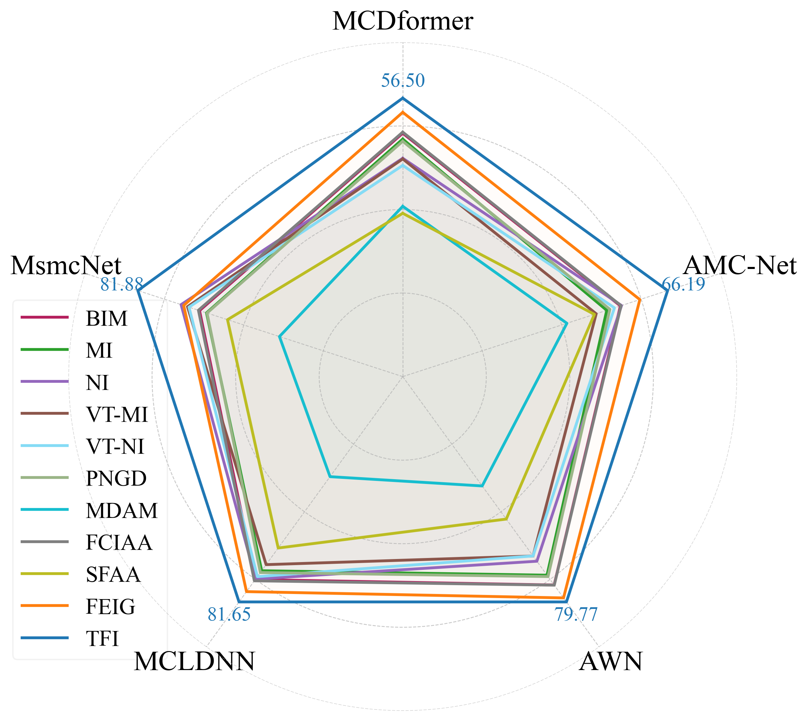 | 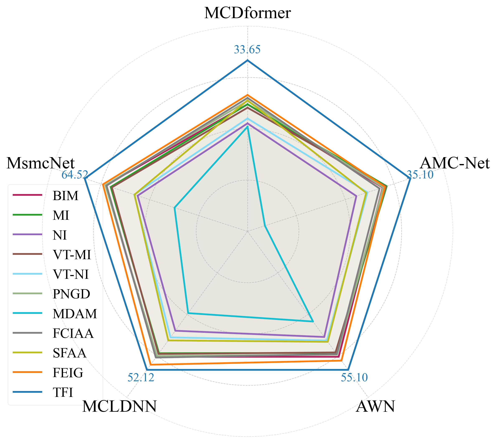 | 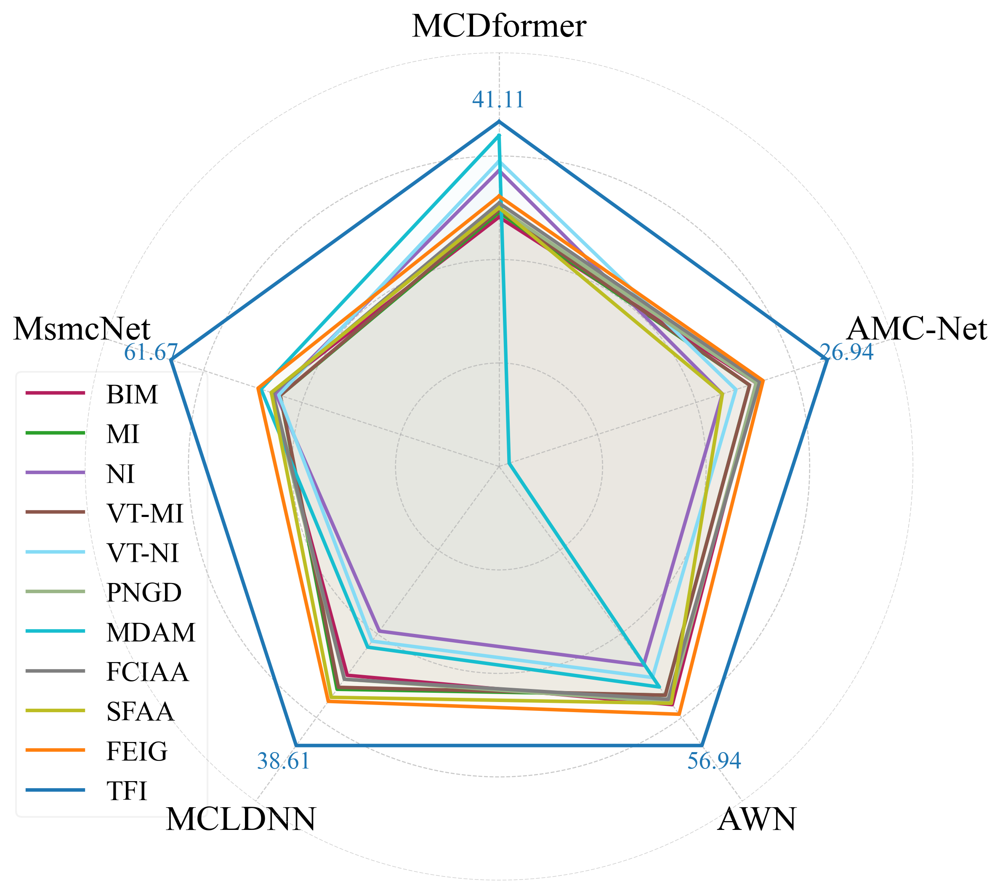 |
| MIMO.Nt64Nr16 | MIMO.Nt16Nr4 | MIMO.Nt4Nr2 |
| 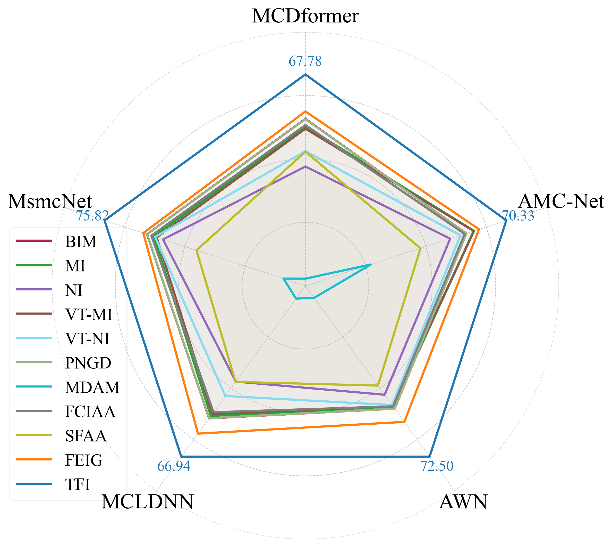 | 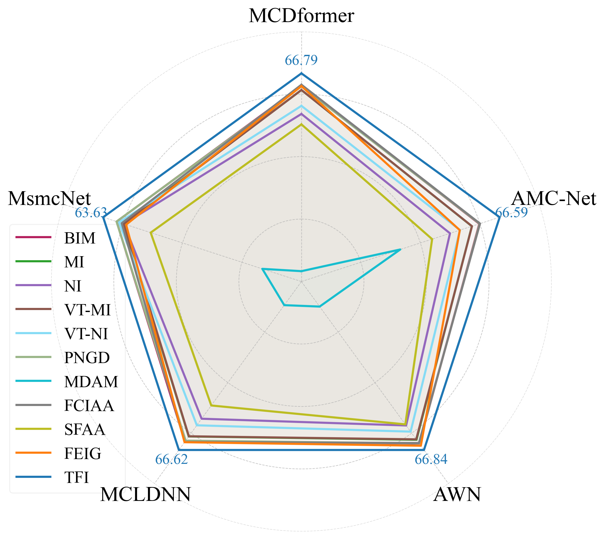 | 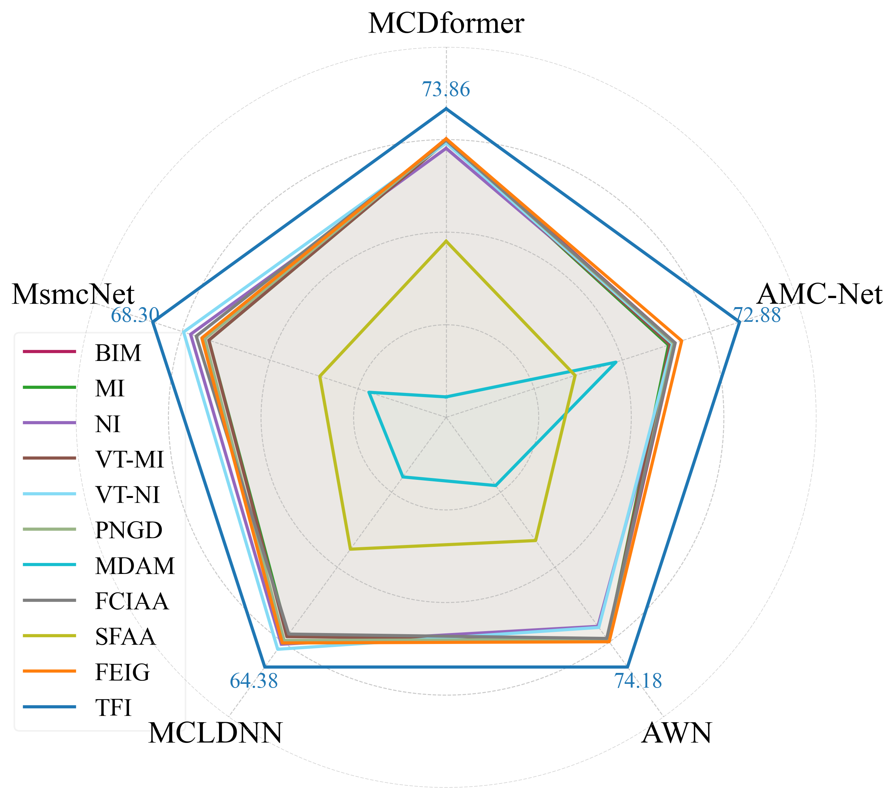 |

Table S2 gives the CTDNN and ResNet surrogate results for each target across all six datasets. Tables S3 and S4 extend the all-pairs comparison in the paper to HisarMod2019.1 and MIMO.Nt64Nr16. All values are average ASR (%) across the retained SNR levels. Boldface follows the source tables.

### Table S2. CTDNN and ResNet surrogate transfer ASR (%) on six datasets

| Dataset | Surrogate | Target | BIM | MI | NI | VT-MI | VT-NI | PNGD | MDAM | FCIAA | SFAA | FEIG | TFI |
| --- | --- | --- | --- | --- | --- | --- | --- | --- | --- | --- | --- | --- | --- |
| RML2016.10b | CTDNN | MCDformer | 57.44 | 54.80 | 36.50 | 40.51 | 38.05 | 57.53 | 1.55 | 57.93 | 34.58 | 58.80 | **63.96** |
| RML2016.10b | CTDNN | AMC-Net | 59.44 | 57.98 | 48.82 | 48.89 | 51.00 | 59.56 | 1.92 | 60.19 | 46.76 | 61.06 | **71.75** |
| RML2016.10b | CTDNN | AWN | 69.51 | 68.44 | 50.42 | 57.11 | 54.46 | 69.51 | 3.09 | 69.76 | 48.23 | 70.94 | **80.24** |
| RML2016.10b | CTDNN | MCLDNN | 69.83 | 68.38 | 56.91 | 63.99 | 60.39 | 69.75 | 4.08 | 70.11 | 58.30 | 71.20 | **83.26** |
| RML2016.10b | CTDNN | MsmcNet | 62.32 | 60.47 | 53.21 | 60.14 | 56.30 | 62.41 | 8.30 | 62.69 | 51.94 | 62.65 | **76.51** |
| RML2016.10b | ResNet | MCDformer | 49.38 | 48.19 | 44.30 | 44.16 | 42.85 | 47.74 | 34.55 | 49.60 | 33.13 | 53.62 | **56.50** |
| RML2016.10b | ResNet | AMC-Net | 54.39 | 50.98 | 54.67 | 48.34 | 52.90 | 51.76 | 41.02 | 54.56 | 47.89 | 59.25 | **66.19** |
| RML2016.10b | ResNet | AWN | 73.78 | 70.30 | 65.36 | 63.51 | 63.49 | 70.79 | 38.71 | 73.83 | 50.44 | 78.35 | **79.77** |
| RML2016.10b | ResNet | MCLDNN | 73.55 | 70.35 | 73.35 | 68.14 | 72.49 | 71.00 | 36.26 | 74.00 | 62.11 | 77.92 | **81.65** |
| RML2016.10b | ResNet | MsmcNet | 62.81 | 60.65 | 68.51 | 66.53 | 66.07 | 60.49 | 38.11 | 63.15 | 54.16 | 67.71 | **81.88** |
| HisarMod2019.1 | CTDNN | MCDformer | 35.58 | 32.88 | 27.21 | 33.17 | 28.37 | 35.58 | 21.35 | 36.06 | 33.94 | 35.19 | **39.81** |
| HisarMod2019.1 | CTDNN | AMC-Net | 33.85 | 33.27 | 30.48 | 33.27 | 31.35 | 34.04 | 23.85 | 34.62 | 31.73 | 33.94 | **38.08** |
| HisarMod2019.1 | CTDNN | AWN | 48.94 | 48.27 | 44.71 | 48.37 | 46.35 | 48.85 | 35.77 | 49.04 | 46.06 | 48.56 | **50.19** |
| HisarMod2019.1 | CTDNN | MCLDNN | 49.04 | 44.62 | 43.65 | 44.52 | 44.90 | 48.85 | 35.00 | 49.13 | 42.98 | 49.52 | **52.88** |
| HisarMod2019.1 | CTDNN | MsmcNet | 53.17 | 51.63 | 48.75 | 51.73 | 49.52 | 53.08 | 29.71 | 53.27 | 48.85 | 53.65 | **55.77** |
| HisarMod2019.1 | ResNet | MCDformer | 25.00 | 25.00 | 21.25 | 24.33 | 22.21 | 25.67 | 20.58 | 26.25 | 25.77 | 26.83 | **33.65** |
| HisarMod2019.1 | ResNet | AMC-Net | 29.13 | 30.00 | 23.46 | 29.81 | 25.87 | 29.23 | 3.75 | 28.46 | 25.58 | 29.62 | **35.10** |
| HisarMod2019.1 | ResNet | AWN | 49.90 | 48.37 | 42.02 | 48.17 | 43.46 | 49.04 | 35.87 | 48.85 | 43.94 | 51.44 | **55.10** |
| HisarMod2019.1 | ResNet | MCLDNN | 47.21 | 45.87 | 37.40 | 46.15 | 39.90 | 46.92 | 30.77 | 47.50 | 41.06 | 50.19 | **52.12** |
| HisarMod2019.1 | ResNet | MsmcNet | 56.25 | 54.23 | 43.56 | 53.75 | 44.90 | 56.35 | 28.94 | 55.87 | 44.81 | 57.31 | **64.52** |
| Panoradio.HF | CTDNN | MCDformer | 21.39 | 21.11 | 24.17 | 21.39 | 23.06 | 21.11 | 33.89 | 22.22 | 23.61 | 19.72 | **37.50** |
| Panoradio.HF | CTDNN | AMC-Net | 9.17 | 10.00 | 8.89 | 10.28 | 7.78 | 9.17 | 7.50 | 9.44 | 8.89 | 8.89 | **12.22** |
| Panoradio.HF | CTDNN | AWN | 24.72 | 26.67 | 29.44 | 26.67 | 30.00 | 24.72 | 38.33 | 25.28 | 31.67 | 24.44 | **46.94** |
| Panoradio.HF | CTDNN | MCLDNN | 22.22 | 22.78 | 16.11 | 23.33 | 19.72 | 22.50 | 22.78 | 23.61 | 22.78 | 20.83 | **40.28** |
| Panoradio.HF | CTDNN | MsmcNet | 23.33 | 23.89 | 24.17 | 23.61 | 24.44 | 23.33 | 39.17 | 24.72 | 28.33 | 24.72 | **45.56** |
| Panoradio.HF | ResNet | MCDformer | 29.72 | 30.28 | 35.28 | 30.56 | 36.39 | 30.83 | 39.44 | 31.39 | 30.83 | 32.22 | **41.11** |
| Panoradio.HF | ResNet | AMC-Net | 21.11 | 20.56 | 18.33 | 20.56 | 19.44 | 21.11 | 0.83 | 21.39 | 18.33 | 21.67 | **26.94** |
| Panoradio.HF | ResNet | AWN | 48.61 | 46.67 | 40.56 | 46.67 | 43.06 | 48.06 | 45.00 | 47.50 | 48.33 | 50.56 | **56.94** |
| Panoradio.HF | ResNet | MCLDNN | 28.89 | 30.83 | 22.78 | 30.56 | 24.17 | 29.44 | 25.00 | 29.44 | 31.94 | 32.50 | **38.61** |
| Panoradio.HF | ResNet | MsmcNet | 42.78 | 41.11 | 41.94 | 41.11 | 41.39 | 42.78 | 44.72 | 42.50 | 42.78 | 45.28 | **61.67** |
| MIMO.Nt64Nr16 | CTDNN | MCDformer | 18.82 | 23.12 | 9.44 | 23.30 | 9.80 | 18.76 | 15.33 | 18.51 | 21.76 | 19.49 | **30.56** |
| MIMO.Nt64Nr16 | CTDNN | AMC-Net | 25.29 | 29.26 | 8.92 | 29.36 | 10.49 | 25.13 | 19.04 | 24.13 | 21.80 | 26.18 | **38.14** |
| MIMO.Nt64Nr16 | CTDNN | AWN | 14.62 | 17.32 | 4.28 | 17.55 | 4.66 | 14.30 | 17.09 | 14.26 | 20.95 | 14.75 | **32.53** |
| MIMO.Nt64Nr16 | CTDNN | MCLDNN | 13.43 | 19.62 | 6.08 | 19.54 | 8.40 | 12.99 | 17.27 | 13.14 | 20.13 | 13.92 | **31.75** |
| MIMO.Nt64Nr16 | CTDNN | MsmcNet | 24.95 | 29.85 | 13.91 | 29.93 | 15.07 | 24.87 | 24.20 | 23.43 | 29.38 | 24.89 | **39.46** |
| MIMO.Nt64Nr16 | ResNet | MCDformer | 53.55 | 51.11 | 38.24 | 50.38 | 43.17 | 53.45 | 2.27 | 51.55 | 43.01 | 55.93 | **67.78** |
| MIMO.Nt64Nr16 | ResNet | AMC-Net | 56.34 | 59.04 | 50.69 | 58.91 | 54.28 | 56.36 | 22.89 | 55.75 | 40.29 | 60.78 | **70.33** |
| MIMO.Nt64Nr16 | ResNet | AWN | 52.14 | 51.23 | 46.24 | 51.06 | 50.60 | 52.14 | 5.13 | 51.18 | 42.35 | 57.75 | **72.50** |
| MIMO.Nt64Nr16 | ResNet | MCLDNN | 51.94 | 51.01 | 37.55 | 50.16 | 43.19 | 51.88 | 5.05 | 49.54 | 37.66 | 57.92 | **66.94** |
| MIMO.Nt64Nr16 | ResNet | MsmcNet | 59.79 | 57.17 | 53.73 | 56.13 | 56.72 | 59.74 | 8.27 | 58.15 | 41.13 | 61.19 | **75.82** |
| MIMO.Nt16Nr4 | CTDNN | MCDformer | 37.16 | 38.21 | 18.87 | 38.11 | 22.38 | 37.60 | 17.65 | 35.74 | 23.46 | 38.90 | **43.70** |
| MIMO.Nt16Nr4 | CTDNN | AMC-Net | 29.63 | 30.07 | 16.40 | 29.98 | 19.41 | 29.63 | 17.33 | 29.51 | 20.71 | 29.98 | **37.77** |
| MIMO.Nt16Nr4 | CTDNN | AWN | 36.91 | 35.42 | 14.61 | 35.37 | 18.11 | 37.45 | 18.65 | 37.94 | 22.94 | 39.39 | **48.97** |
| MIMO.Nt16Nr4 | CTDNN | MCLDNN | 27.45 | 25.86 | 13.92 | 25.74 | 15.42 | 27.94 | 16.72 | 28.09 | 18.63 | 28.16 | **41.69** |
| MIMO.Nt16Nr4 | CTDNN | MsmcNet | 41.05 | 39.53 | 24.93 | 39.53 | 29.51 | 42.11 | 22.92 | 40.54 | 28.90 | 41.96 | **47.79** |
| MIMO.Nt16Nr4 | ResNet | MCDformer | 62.79 | 61.45 | 53.77 | 61.45 | 56.37 | 62.62 | 3.33 | 63.14 | 50.42 | 62.70 | **66.79** |
| MIMO.Nt16Nr4 | ResNet | AMC-Net | 59.75 | 57.25 | 49.90 | 57.28 | 53.26 | 59.85 | 33.19 | 59.98 | 43.90 | 53.19 | **66.59** |
| MIMO.Nt16Nr4 | ResNet | AWN | 64.29 | 62.77 | 57.11 | 62.62 | 59.56 | 64.22 | 9.93 | 64.09 | 56.67 | 65.15 | **66.84** |
| MIMO.Nt16Nr4 | ResNet | MCLDNN | 63.31 | 61.27 | 54.26 | 61.20 | 56.86 | 62.94 | 9.34 | 63.46 | 49.02 | 63.55 | **66.62** |
| MIMO.Nt16Nr4 | ResNet | MsmcNet | 59.31 | 57.13 | 56.96 | 57.01 | 58.55 | 59.34 | 12.55 | 57.67 | 48.38 | 56.27 | **63.63** |
| MIMO.Nt4Nr2 | CTDNN | MCDformer | 38.89 | 38.89 | 25.82 | 37.91 | 29.41 | 39.22 | 19.61 | 40.20 | 22.88 | 40.85 | **49.67** |
| MIMO.Nt4Nr2 | CTDNN | AMC-Net | 36.60 | 37.25 | 33.33 | 38.24 | 36.27 | 38.56 | 19.61 | 39.22 | 24.51 | 34.97 | **52.61** |
| MIMO.Nt4Nr2 | CTDNN | AWN | 43.79 | 41.83 | 31.37 | 41.50 | 34.97 | 45.42 | 18.63 | 46.41 | 23.86 | 45.75 | **53.27** |
| MIMO.Nt4Nr2 | CTDNN | MCLDNN | 32.68 | 34.31 | 26.47 | 34.64 | 30.07 | 34.31 | 20.59 | 33.33 | 19.61 | 33.99 | **48.69** |
| MIMO.Nt4Nr2 | CTDNN | MsmcNet | 46.08 | 47.39 | 34.64 | 47.39 | 35.62 | 48.37 | 23.20 | 45.75 | 23.86 | 49.02 | **56.54** |
| MIMO.Nt4Nr2 | ResNet | MCDformer | 66.67 | 66.01 | 64.38 | 66.01 | 65.69 | 66.34 | 4.90 | 66.34 | 42.16 | 66.67 | **73.86** |
| MIMO.Nt4Nr2 | ResNet | AMC-Net | 56.86 | 55.23 | 56.86 | 55.56 | 56.21 | 56.54 | 42.16 | 56.86 | 32.03 | 58.50 | **72.88** |
| MIMO.Nt4Nr2 | ResNet | AWN | 66.01 | 66.01 | 62.09 | 66.01 | 62.42 | 66.01 | 20.26 | 65.69 | 36.60 | 66.67 | **74.18** |
| MIMO.Nt4Nr2 | ResNet | MCLDNN | 57.84 | 56.21 | 58.50 | 56.54 | 59.80 | 57.52 | 15.36 | 55.88 | 33.99 | 58.17 | **64.38** |
| MIMO.Nt4Nr2 | ResNet | MsmcNet | 56.21 | 55.23 | 59.48 | 55.23 | 61.11 | 56.21 | 17.97 | 58.17 | 29.41 | 56.86 | **68.30** |

### Table S3. All-pairs transfer ASR (%) on HisarMod2019.1

| Surrogate | Target | BIM | MI | NI | VT-MI | VT-NI | PNGD | MDAM | FCIAA | SFAA | FEIG | TFI |
| --- | --- | --- | --- | --- | --- | --- | --- | --- | --- | --- | --- | --- |
| MCDformer | AMC-Net | 22.31 | 23.17 | 20.29 | 23.94 | 21.35 | 22.60 | 11.35 | 22.02 | 23.46 | 23.17 | **33.65** |
| MCDformer | AWN | 37.88 | 39.23 | 35.77 | 39.13 | 35.10 | 37.60 | 27.12 | 39.33 | 38.56 | 39.04 | **47.88** |
| MCDformer | CTDNN | 1.44 | 1.54 | 1.44 | 1.54 | 1.73 | 1.25 | 0.96 | 1.83 | 1.44 | 1.54 | **3.75** |
| MCDformer | MCLDNN | 40.77 | 41.15 | 42.50 | 41.44 | 44.23 | 41.54 | 22.88 | 41.15 | 44.62 | 41.73 | **51.63** |
| MCDformer | MsmcNet | 33.37 | 33.85 | 31.63 | 33.37 | 32.79 | 33.56 | 24.71 | 33.17 | 31.54 | 32.60 | **43.65** |
| MCDformer | ResNet | 15.19 | 14.90 | 13.65 | 15.38 | 14.33 | 14.90 | 5.10 | 14.62 | 15.00 | 14.13 | **22.40** |
| AMC-Net | MCDformer | 24.42 | 24.81 | 23.94 | 24.62 | 23.08 | 24.23 | 14.42 | 26.35 | 26.25 | 25.19 | **33.85** |
| AMC-Net | AWN | 45.87 | 47.40 | 45.87 | 47.02 | 46.06 | 45.67 | 24.13 | 45.38 | 46.15 | 45.96 | **52.69** |
| AMC-Net | CTDNN | 3.65 | 3.65 | 4.62 | 3.65 | 4.71 | 3.46 | 4.23 | 3.94 | 3.46 | 3.56 | **38.27** |
| AMC-Net | MCLDNN | 39.04 | 40.38 | 41.15 | 39.52 | 40.77 | 38.65 | 17.79 | 39.62 | 40.38 | 38.85 | **46.73** |
| AMC-Net | MsmcNet | 34.52 | 33.65 | 39.42 | 34.13 | 38.75 | 33.56 | 19.90 | 34.42 | 35.00 | 34.90 | **42.12** |
| AMC-Net | ResNet | 14.62 | 15.58 | 18.75 | 14.90 | 19.62 | 14.62 | 3.65 | 14.42 | 16.25 | 14.90 | **23.56** |
| AWN | MCDformer | 29.33 | 28.46 | 20.00 | 28.08 | 22.60 | 29.04 | 13.56 | 29.81 | 28.65 | 30.67 | **38.46** |
| AWN | AMC-Net | 49.33 | 47.21 | 28.94 | 47.79 | 33.17 | 49.52 | 16.44 | 48.37 | 35.87 | 51.54 | **56.73** |
| AWN | CTDNN | 3.37 | 3.08 | 2.79 | 3.27 | 2.98 | 3.37 | 2.31 | 3.56 | 2.88 | **4.33** | 3.46 |
| AWN | MCLDNN | 60.19 | 57.21 | 45.29 | 57.31 | 48.85 | 59.33 | 19.33 | 59.04 | 50.38 | 63.56 | **76.35** |
| AWN | MsmcNet | 51.15 | 49.13 | 45.87 | 48.75 | 46.35 | 50.87 | 22.60 | 51.73 | 42.79 | 53.46 | **64.42** |
| AWN | ResNet | 35.10 | 33.17 | 25.87 | 33.75 | 27.12 | 34.71 | 5.48 | 34.23 | 28.85 | 40.38 | **51.83** |
| CTDNN | MCDformer | 35.58 | 32.88 | 27.21 | 33.17 | 28.37 | 35.58 | 21.35 | 36.06 | 33.94 | 35.19 | **39.81** |
| CTDNN | AMC-Net | 33.85 | 33.27 | 30.48 | 33.27 | 31.35 | 34.04 | 23.85 | 34.62 | 31.73 | 33.94 | **38.08** |
| CTDNN | AWN | 48.94 | 48.27 | 44.71 | 48.37 | 46.35 | 48.85 | 35.77 | 49.04 | 46.06 | 48.56 | **50.19** |
| CTDNN | MCLDNN | 49.04 | 44.62 | 43.65 | 44.52 | 44.90 | 48.85 | 35.00 | 49.13 | 42.98 | 49.52 | **52.88** |
| CTDNN | MsmcNet | 53.17 | 51.63 | 48.75 | 51.73 | 49.52 | 53.08 | 29.71 | 53.27 | 48.85 | 53.65 | **55.77** |
| CTDNN | ResNet | 30.77 | 29.52 | 27.79 | 29.62 | 30.00 | 30.77 | 11.83 | 31.35 | 28.37 | 31.54 | **38.56** |
| MCLDNN | MCDformer | 38.85 | 34.71 | 32.12 | 34.13 | 35.10 | 39.04 | 19.62 | 38.65 | 37.98 | 40.19 | **44.71** |
| MCLDNN | AMC-Net | 25.87 | 24.13 | 17.79 | 23.17 | 19.90 | 26.06 | 11.35 | 25.00 | 24.52 | 27.31 | **29.81** |
| MCLDNN | AWN | 47.21 | 45.77 | 35.96 | 46.44 | 33.17 | 51.06 | 31.06 | 47.40 | 42.02 | 49.62 | **57.60** |
| MCLDNN | CTDNN | 3.08 | 2.02 | 0.77 | 2.12 | 0.87 | 3.08 | **11.25** | 2.98 | 1.73 | 3.37 | 3.46 |
| MCLDNN | MsmcNet | 34.52 | 31.35 | 26.25 | 32.69 | 25.29 | 37.12 | 25.19 | 33.85 | 32.88 | 36.35 | **44.33** |
| MCLDNN | ResNet | 19.90 | 17.12 | 10.48 | 16.73 | 10.96 | 22.98 | 7.21 | 19.04 | 16.83 | 24.52 | **28.56** |
| MsmcNet | MCDformer | 38.94 | 37.02 | 27.98 | 37.31 | 30.19 | 38.56 | 22.60 | 39.62 | 31.54 | 40.67 | **45.67** |
| MsmcNet | AMC-Net | 54.71 | 53.08 | 38.17 | 52.88 | 39.52 | 54.81 | 17.21 | 54.23 | 42.69 | 56.63 | **63.08** |
| MsmcNet | AWN | 67.12 | 65.96 | 53.85 | 65.96 | 55.58 | 66.92 | 39.33 | 66.83 | 55.19 | 68.46 | **70.87** |
| MsmcNet | CTDNN | 8.17 | 8.17 | 7.79 | 8.37 | 7.88 | 8.27 | 6.92 | 8.08 | 8.08 | 8.17 | **10.38** |
| MsmcNet | MCLDNN | 68.27 | 64.90 | 49.62 | 64.52 | 52.21 | 68.46 | 34.71 | 67.40 | 53.37 | 69.71 | **73.56** |
| MsmcNet | ResNet | 66.06 | 64.52 | 45.19 | 64.81 | 48.17 | 66.06 | 12.12 | 65.77 | 50.77 | 67.40 | **71.06** |
| ResNet | MCDformer | 25.00 | 25.00 | 21.25 | 24.33 | 22.21 | 25.67 | 20.58 | 26.25 | 25.77 | 26.83 | **33.65** |
| ResNet | AMC-Net | 29.13 | 30.00 | 23.46 | 29.81 | 25.87 | 29.23 | 3.75 | 28.46 | 25.58 | 29.62 | **35.10** |
| ResNet | AWN | 49.90 | 48.37 | 42.02 | 48.17 | 43.46 | 49.04 | 35.87 | 48.85 | 43.94 | 51.44 | **55.10** |
| ResNet | CTDNN | 4.52 | 4.23 | 3.94 | 4.04 | 3.85 | 4.52 | **33.17** | 4.62 | 2.02 | 4.23 | 6.15 |
| ResNet | MCLDNN | 47.21 | 45.87 | 37.40 | 46.15 | 39.90 | 46.92 | 30.77 | 47.50 | 41.06 | 50.19 | **52.12** |
| ResNet | MsmcNet | 56.25 | 54.23 | 43.56 | 53.75 | 44.90 | 56.35 | 28.94 | 55.87 | 44.81 | 57.31 | **64.52** |

### Table S4. All-pairs transfer ASR (%) on MIMO.Nt64Nr16

| Surrogate | Target | BIM | MI | NI | VT-MI | VT-NI | PNGD | MDAM | FCIAA | SFAA | FEIG | TFI |
| --- | --- | --- | --- | --- | --- | --- | --- | --- | --- | --- | --- | --- |
| MCDformer | AMC-Net | 50.88 | 52.09 | 35.05 | 52.16 | 41.37 | 51.03 | 7.16 | 49.75 | 36.85 | 51.11 | **64.49** |
| MCDformer | AWN | 48.74 | 48.82 | 30.34 | 49.04 | 36.93 | 48.92 | 5.11 | 47.61 | 37.21 | 49.28 | **63.99** |
| MCDformer | CTDNN | 43.22 | 42.66 | 21.67 | 42.58 | 25.07 | 43.64 | 9.08 | 42.19 | 39.07 | 43.79 | **56.36** |
| MCDformer | MCLDNN | 43.25 | 41.41 | 26.18 | 41.39 | 29.36 | 43.66 | 3.45 | 42.75 | 35.29 | 44.10 | **62.24** |
| MCDformer | MsmcNet | 54.23 | 54.71 | 31.55 | 54.49 | 39.35 | 54.17 | 8.64 | 53.15 | 37.97 | 54.58 | **70.82** |
| MCDformer | ResNet | 44.17 | 48.74 | 32.84 | 48.82 | 40.31 | 44.51 | 8.46 | 43.24 | 41.39 | 44.98 | **60.33** |
| AMC-Net | MCDformer | 51.50 | 51.14 | 44.33 | 51.26 | 48.33 | 51.39 | 4.71 | 52.21 | 40.16 | 50.77 | **67.88** |
| AMC-Net | AWN | 61.45 | 59.61 | 53.04 | 59.98 | 55.78 | 61.14 | 5.39 | 60.56 | 39.15 | 63.66 | **66.58** |
| AMC-Net | CTDNN | 48.43 | 47.35 | 41.57 | 47.22 | 43.76 | 48.35 | 8.43 | 46.41 | 39.89 | 49.93 | **53.79** |
| AMC-Net | MCLDNN | 56.72 | 55.39 | 42.76 | 55.44 | 48.22 | 56.55 | 3.30 | 56.44 | 37.30 | 58.91 | **70.31** |
| AMC-Net | MsmcNet | 57.11 | 57.99 | 54.67 | 58.12 | 55.64 | 57.27 | 10.20 | 57.30 | 42.06 | 60.05 | **70.59** |
| AMC-Net | ResNet | 62.42 | 59.92 | 54.75 | 60.36 | 56.45 | 62.25 | 8.17 | 61.03 | 42.16 | 64.61 | **66.47** |
| AWN | MCDformer | 59.79 | 56.98 | 58.64 | 56.88 | 60.44 | 59.59 | 5.41 | 59.02 | 35.95 | 62.37 | **70.46** |
| AWN | AMC-Net | 58.40 | 58.01 | 57.37 | 57.99 | 59.43 | 58.37 | 11.21 | 57.14 | 34.80 | 61.29 | **65.85** |
| AWN | CTDNN | 45.51 | 42.53 | 37.03 | 42.45 | 38.73 | 45.46 | 10.77 | 47.27 | 38.27 | 46.06 | **52.50** |
| AWN | MCLDNN | 55.08 | 54.61 | 52.61 | 54.66 | 55.96 | 55.31 | 3.89 | 54.26 | 34.08 | 59.15 | **67.58** |
| AWN | MsmcNet | 61.62 | 61.05 | 64.33 | 60.87 | 65.15 | 61.39 | 12.21 | 60.75 | 39.53 | 63.30 | **77.71** |
| AWN | ResNet | 64.59 | 62.66 | 62.42 | 62.52 | 63.40 | 64.71 | 11.83 | 63.81 | 38.77 | **67.96** | 66.58 |
| CTDNN | MCDformer | 18.82 | 23.12 | 9.44 | 23.30 | 9.80 | 18.76 | 15.33 | 18.51 | 21.76 | 19.49 | **30.56** |
| CTDNN | AMC-Net | 25.29 | 29.26 | 8.92 | 29.36 | 10.49 | 25.13 | 19.04 | 24.13 | 21.80 | 26.18 | **38.14** |
| CTDNN | AWN | 14.62 | 17.32 | 4.28 | 17.55 | 4.66 | 14.30 | 17.09 | 14.26 | 20.95 | 14.75 | **32.53** |
| CTDNN | MCLDNN | 13.43 | 19.62 | 6.08 | 19.54 | 8.40 | 12.99 | 17.27 | 13.14 | 20.13 | 13.92 | **31.75** |
| CTDNN | MsmcNet | 24.95 | 29.85 | 13.91 | 29.93 | 15.07 | 24.87 | 24.20 | 23.43 | 29.38 | 24.89 | **39.46** |
| CTDNN | ResNet | 29.97 | 39.85 | 22.04 | 39.71 | 24.90 | 29.61 | 15.56 | 26.41 | 20.78 | 30.51 | **41.08** |
| MCLDNN | MCDformer | 24.89 | 22.78 | 15.07 | 22.75 | 16.62 | 24.93 | 3.45 | 23.79 | 29.85 | 29.31 | **49.23** |
| MCLDNN | AMC-Net | 26.01 | 23.06 | 15.49 | 22.86 | 18.56 | 25.92 | 8.76 | 25.15 | 28.82 | 31.05 | **51.03** |
| MCLDNN | AWN | 22.81 | 21.14 | 13.64 | 21.23 | 15.29 | 22.83 | 2.29 | 21.96 | 29.51 | 29.93 | **51.05** |
| MCLDNN | CTDNN | 22.71 | 20.74 | 25.51 | 20.75 | 23.77 | 23.10 | 5.15 | 22.89 | 36.14 | 27.01 | **42.19** |
| MCLDNN | MsmcNet | 22.25 | 20.59 | 22.94 | 20.75 | 22.75 | 22.25 | 4.62 | 21.54 | 32.57 | 28.46 | **48.91** |
| MCLDNN | ResNet | 26.01 | 24.54 | 17.57 | 24.44 | 19.80 | 26.08 | 5.57 | 24.71 | 30.25 | 31.68 | **51.24** |
| MsmcNet | MCDformer | 53.12 | 53.04 | 43.04 | 53.09 | 45.69 | 52.99 | 11.65 | 53.25 | 28.37 | 55.75 | **64.93** |
| MsmcNet | AMC-Net | 54.58 | 55.11 | 52.96 | 55.21 | 54.87 | 54.49 | 39.98 | 54.72 | 29.04 | 56.52 | **60.44** |
| MsmcNet | AWN | 56.47 | 56.36 | 47.81 | 56.31 | 50.36 | 56.67 | 17.71 | 56.24 | 30.70 | 57.50 | **62.71** |
| MsmcNet | CTDNN | 43.19 | 41.01 | 36.85 | 41.08 | 38.07 | 42.97 | 26.03 | 44.18 | 37.11 | 42.86 | **47.40** |
| MsmcNet | MCLDNN | 53.37 | 55.08 | 44.22 | 54.89 | 45.92 | 53.25 | 15.18 | 52.32 | 27.35 | 54.82 | **61.27** |
| MsmcNet | ResNet | 59.31 | 59.87 | 56.96 | 59.79 | 59.15 | 59.22 | 18.42 | 58.14 | 30.21 | 61.01 | **62.35** |
| ResNet | MCDformer | 53.55 | 51.11 | 38.24 | 50.38 | 43.17 | 53.45 | 2.27 | 51.55 | 43.01 | 55.93 | **67.78** |
| ResNet | AMC-Net | 56.34 | 59.04 | 50.69 | 58.91 | 54.28 | 56.36 | 22.89 | 55.75 | 40.29 | 60.78 | **70.33** |
| ResNet | AWN | 52.14 | 51.23 | 46.24 | 51.06 | 50.60 | 52.14 | 5.13 | 51.18 | 42.35 | 57.75 | **72.50** |
| ResNet | CTDNN | 40.75 | 40.85 | 39.71 | 41.00 | 42.30 | 40.77 | 12.34 | 41.34 | 41.39 | 46.34 | **64.33** |
| ResNet | MCLDNN | 51.94 | 51.01 | 37.55 | 50.16 | 43.19 | 51.88 | 5.05 | 49.54 | 37.66 | 57.92 | **66.94** |
| ResNet | MsmcNet | 59.79 | 57.17 | 53.73 | 56.13 | 56.72 | 59.74 | 8.27 | 58.15 | 41.13 | 61.19 | **75.82** |

The detailed tables show that TFI has the highest ASR in every listed CTDNN and ResNet surrogate setting in Table S2. In the all-pairs tables, several individual source-target pairs favor a baseline, so the conclusion is strongest for the overall pattern across pairs.

**Figure S2.** Transfer ASR (%) by SNR on MIMO.Nt64Nr16 at PSR $=-10$ dB, using CTDNN as the surrogate model. Each panel names its target.

| MCDformer | AMC-Net | AWN | MCLDNN | MsmcNet |
| --- | --- | --- | --- | --- |
| 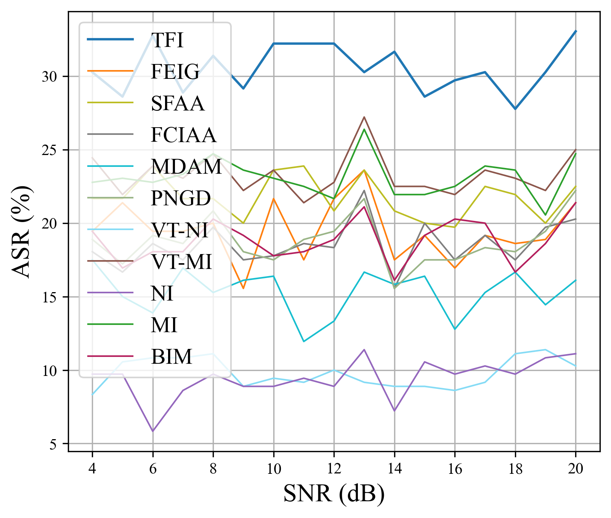 | 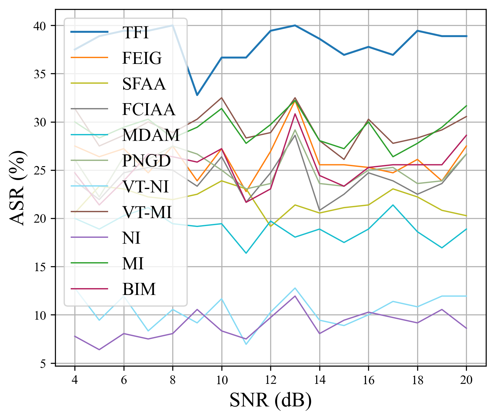 | 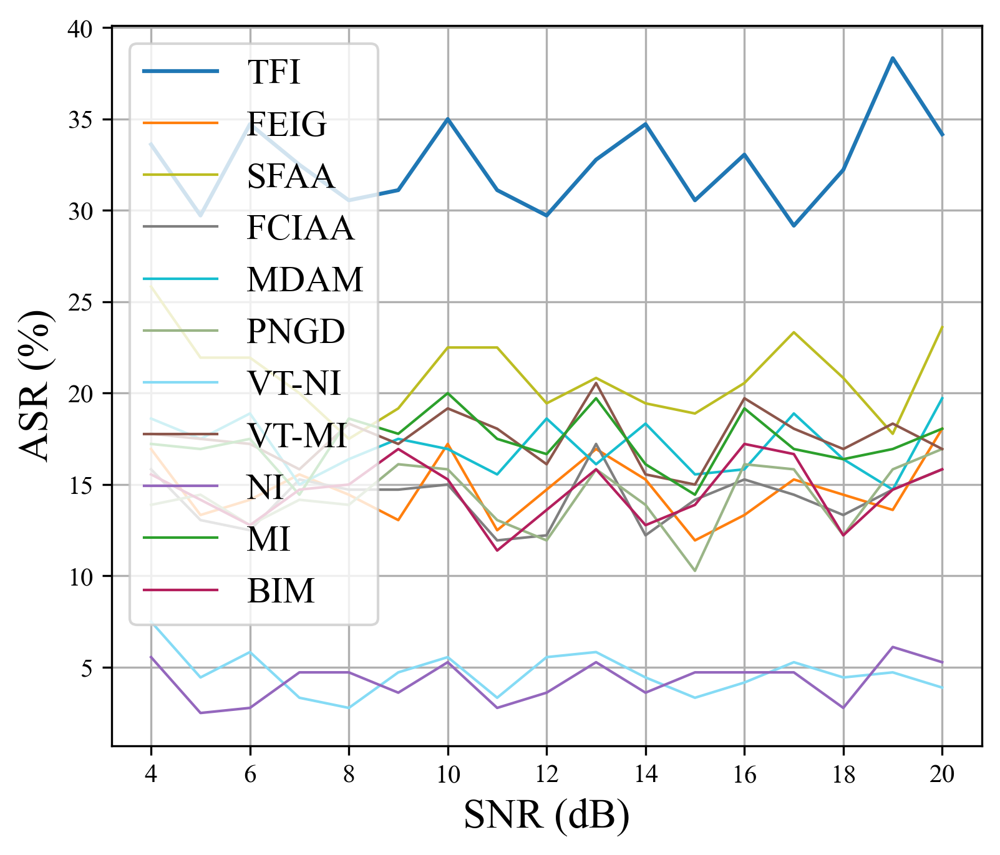 | 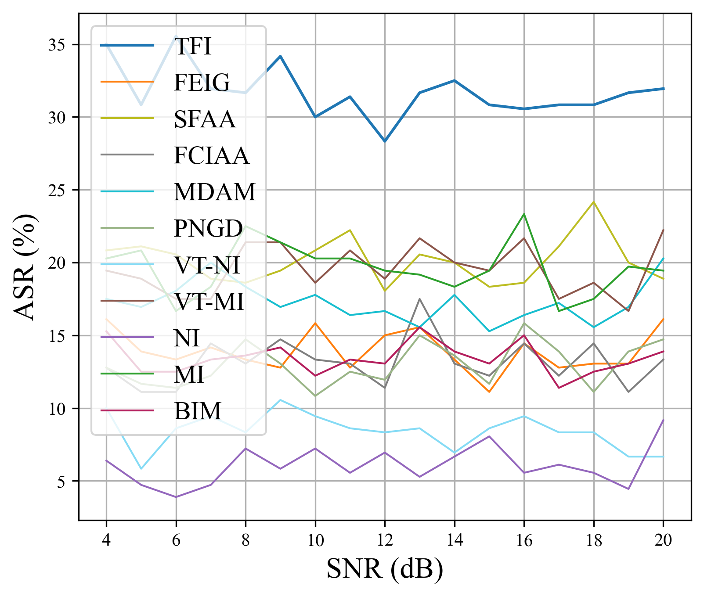 | 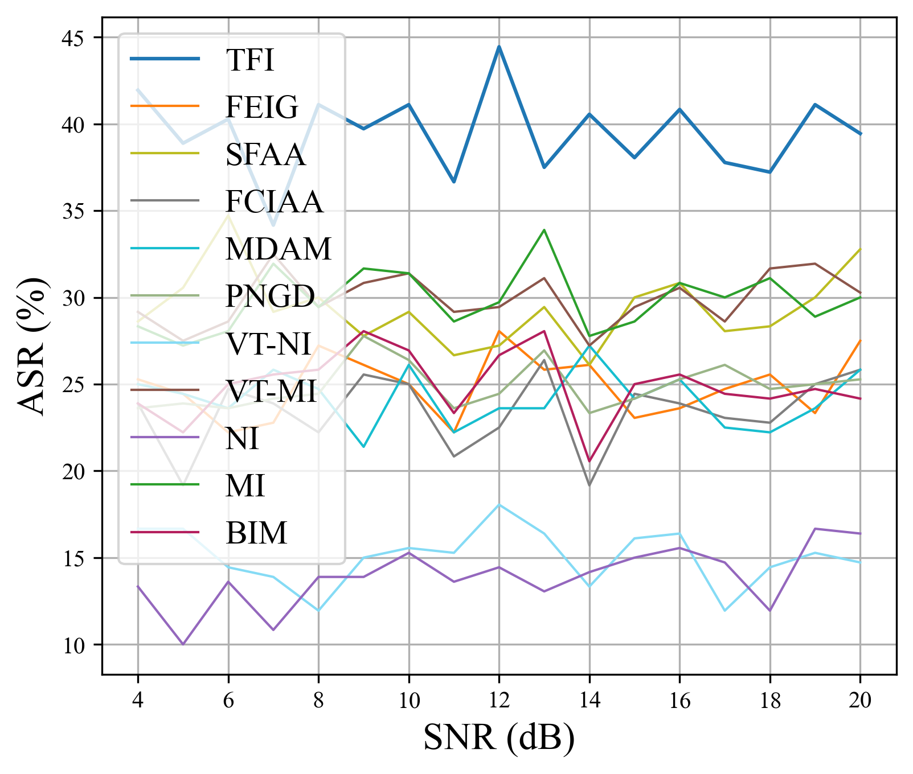 |

## S4. Computational cost

The main paper reports per-example generation time in its Table on computational cost. On RML2016.10b, HisarMod2019.1, and Panoradio.HF, TFI takes 0.24, 0.31, and 0.35 ms, respectively, at SNR 10 dB. The corresponding BIM times are 0.19, 0.24, and 0.28 ms; VT-MI takes 3.84, 4.09, and 4.34 ms. Thus, TFI adds a small measured cost relative to BIM and is much faster than this transformation-based baseline in these three settings. These timings characterize the evaluated hardware and signal lengths, rather than proving a general scaling law.
